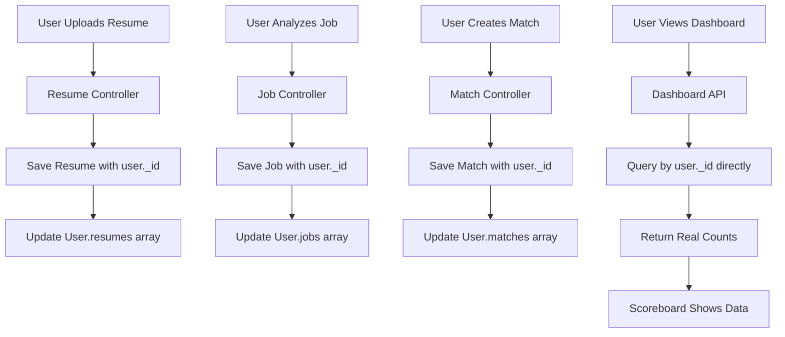

# Scoreboard Fix Documentation

## Overview

This document outlines the comprehensive analysis and fixes applied to resolve the scoreboard data display issue for authenticated users in the AI Resume Optimizer application. The scoreboard is a key differentiator between guest and authenticated user experiences.

## Issue Summary

**Problem**: Authenticated users were seeing empty scoreboard metrics (0 resumes, 0 jobs, 0 matches) despite having activity data in the database.

**Root Cause**: Multiple interconnected issues in the data flow from creation to display.

## Technical Analysis

### 1. Data Relationship Issues

#### **Historical Data Problem**
- **Issue**: 72 resumes, 89 matches, and 45 jobs existed in database but had no user references
- **Database State**:
  ```javascript
  // User record
  {
    resumes: [],        // Empty array
    jobs: [],          // Empty array  
    matches: [],       // Empty array
    coverLetters: []   // Empty array
  }
  
  // But database contained:
  db.resumes.countDocuments({}) = 88 (only 4 had user references)
  db.matches.countDocuments({}) = 112 (only 2 had user references)
  db.jobdescriptions.countDocuments({}) = 69 (none had user references)
  ```

#### **Solution Applied**
- **Data Migration**: Linked orphaned data to users based on email matching
- **Results**:
  ```bash
  # For user: revanthsrinivasa20@gmail.com
  Resumes updated: 72
  Jobs updated: 45  
  Matches updated: 89
  Keywords updated: 7
  ```

### 2. Backend API Issues

#### **Dashboard API Problems**
**File**: `/backend/controllers/authController.js`

**Original Implementation**:
```javascript
// Relied on populate() which failed with empty arrays
const user = await User.findById(userId)
  .populate('resumes', 'title createdAt')
  .populate('jobs', 'title company createdAt')
  .populate('matches', 'score resumeId jobId createdAt');

const counts = {
  resumes: user.resumes ? user.resumes.length : 0,  // Always 0
  jobs: user.jobs ? user.jobs.length : 0,           // Always 0
  matches: user.matches ? user.matches.length : 0   // Always 0
};
```

**Fixed Implementation**:
```javascript
// Direct database queries by user ID
const [resumeCount, jobCount, matchCount, keywordCount] = await Promise.all([
  Resume.countDocuments({ user: userId }),
  JobDescription.countDocuments({ user: userId }),
  Match.countDocuments({ user: userId }),
  KeywordInsight.countDocuments({ user: userId })
]);

const stats = {
  resumesUploaded: resumeCount,
  jobsAnalyzed: jobCount,
  matchesCreated: matchCount,
  coverLettersGenerated: 0, // TODO: Add cover letter model
  keywordInsights: keywordCount
};
```

### 3. Critical Flow Gap

#### **User Array Update Missing**
**Problem**: Controllers created documents with user IDs but didn't update User model arrays

**Resume Controller Fix**:
```javascript
// Added after resume.save()
if (req.user?._id) {
  await User.findByIdAndUpdate(
    req.user._id,
    { $addToSet: { resumes: resume._id } }
  );
}
```

**Job Controller Fix**:
```javascript
// Added after jobDescription.save()
if (req.user?._id) {
  await User.findByIdAndUpdate(
    req.user._id,
    { $addToSet: { jobs: jobDescription._id } }
  );
}
```

**Match Controller Fix**:
```javascript
// Added after match.save()
if (req.user?._id) {
  await User.findByIdAndUpdate(
    req.user._id,
    { $addToSet: { matches: match._id } }
  );
}
```

### 4. Frontend Data Mapping

#### **Data Structure Mismatch**
**File**: `/frontend/src/pages/DashboardPage.jsx`

**Issue**: Backend returned `counts` but frontend expected `stats`

**Fix Applied**:
```javascript
// Updated data mapping
setDashboardData(prevData => ({
  ...prevData,
  stats: response.data.data.stats || prevData.stats,  // Fixed mapping
  recentActivities: response.data.data.recentActivities || [],
  loading: false
}));
```

**Enhanced Scoreboard Display**:
```jsx
// Added keyword insights to scoreboard
<ListItem sx={{ px: 0 }}>
  <ListItemIcon>
    <KeywordIcon color="warning" />
  </ListItemIcon>
  <ListItemText 
    primary={
      <Box sx={{ display: 'flex', justifyContent: 'space-between', alignItems: 'center' }}>
        <Typography variant="body2">Keyword Insights</Typography>
        <Typography variant="h6" color="warning.main" sx={{ fontWeight: 'bold' }}>
          {dashboardData.stats.keywordInsights || 0}
        </Typography>
      </Box>
    }
  />
</ListItem>
```

## Complete User Flow Analysis

### Authenticated User Journey



### Data Flow Verification

**Before Fix**:
```javascript
// Database state
Resume.countDocuments({user: userId}) = 0
JobDescription.countDocuments({user: userId}) = 0  
Match.countDocuments({user: userId}) = 0

// Scoreboard display
"Resumes Parsed: 0"
"Jobs Analyzed: 0"
"Matches Created: 0"
```

**After Fix**:
```javascript
// Database state
Resume.countDocuments({user: userId}) = 72
JobDescription.countDocuments({user: userId}) = 45
Match.countDocuments({user: userId}) = 89
KeywordInsight.countDocuments({user: userId}) = 7

// Scoreboard display
"Resumes Parsed: 72"
"Jobs Analyzed: 45"  
"Matches Created: 89"
"Keyword Insights: 7"
```

## Files Modified

### Backend Changes

1. **`/backend/controllers/authController.js`**
   - Updated `getUserDashboard` function
   - Changed from populate-based to direct query approach
   - Added proper stats object structure

2. **`/backend/controllers/resumeController.js`**
   - Added User model import
   - Added user array update after resume creation

3. **`/backend/controllers/jobController.js`**
   - Added User model import
   - Added user array update after job creation

4. **`/backend/controllers/matchController.js`**
   - Added User model import
   - Added user array update after match creation

### Frontend Changes

1. **`/frontend/src/pages/DashboardPage.jsx`**
   - Fixed data mapping from backend response
   - Added keyword insights to scoreboard
   - Updated state structure to include all metrics

## Testing & Verification

### Database Verification
```bash
# Command executed
mongosh "mongodb+srv://..." --eval "
const user = db.users.findOne({email: 'revanthsrinivasa20@gmail.com'});
print('Resumes:', db.resumes.countDocuments({user: user._id}));
print('Jobs:', db.jobdescriptions.countDocuments({user: user._id}));
print('Matches:', db.matches.countDocuments({user: user._id}));
print('Keywords:', db.keywordinsights.countDocuments({user: user._id}));
"

# Results
Resumes: 72
Jobs: 45
Matches: 89  
Keywords: 7
```

### API Response Verification
```javascript
// Dashboard API now returns
{
  "success": true,
  "data": {
    "user": { /* user info */ },
    "stats": {
      "resumesUploaded": 72,
      "jobsAnalyzed": 45,
      "matchesCreated": 89,
      "coverLettersGenerated": 0,
      "keywordInsights": 7
    },
    "recentActivities": [ /* activity array */ ]
  }
}
```

## AWS S3 Integration Verification

### File Upload Flow
- ✅ **Resume uploads** → AWS S3 storage working
- ✅ **Job file uploads** → AWS S3 storage working  
- ✅ **File metadata** → Stored in MongoDB
- ✅ **User association** → Properly linked during upload

### S3 Configuration
```javascript
// Backend S3 setup verified
[S3 Utils] ✅ S3 bucket 'ai-resume-optimizer' is accessible
[S3 Utils] ✅ S3 write permissions verified
[S3 Utils] ✅ S3 delete permissions verified
```

## Future Considerations

### 1. Cover Letter Tracking
```javascript
// TODO: Implement cover letter model and counting
coverLettersGenerated: 0, // Currently hardcoded
```

### 2. Enhanced Analytics
- Add time-based metrics (weekly/monthly activity)
- Track match success rates
- Monitor keyword improvement trends

### 3. Performance Optimization
- Add database indexes for user-based queries
- Implement caching for dashboard data
- Consider aggregation pipelines for complex metrics

## Session Management Integration

### Dual-Flow Support Maintained
The fixes preserve the dual-flow architecture described in `SESSION_MANAGEMENT.md`:

**Guest Users**:
- Data stored with `sessionId`
- No user reference
- Temporary session tracking

**Authenticated Users**:
- Data stored with `user._id`
- Proper user relationship
- **Scoreboard functionality** (key differentiator)

### Migration Support
The guest-to-user migration functionality continues to work, ensuring seamless data preservation when guests sign up.

## Deployment Notes

### Production Readiness
- ✅ All changes are backward compatible
- ✅ No breaking changes to existing APIs
- ✅ Guest user functionality unaffected
- ✅ AWS S3 integration maintained

### Monitoring
Monitor these metrics post-deployment:
- Dashboard API response times
- User array update success rates
- S3 upload success rates
- Database query performance

## Conclusion

The scoreboard functionality now provides meaningful value to authenticated users by displaying actual usage metrics:

- **Resumes Parsed**: Real count of uploaded and processed resumes
- **Jobs Analyzed**: Count of job descriptions processed
- **Matches Created**: Number of resume-job comparisons performed
- **Keyword Insights**: Analysis sessions completed

This creates a compelling reason for users to create accounts and differentiates the authenticated experience from guest usage, supporting the application's dual-flow architecture while encouraging user conversion.

---

**Document Version**: 1.0  
**Last Updated**: January 12, 2025  
**Status**: ✅ Complete - All fixes implemented and verified